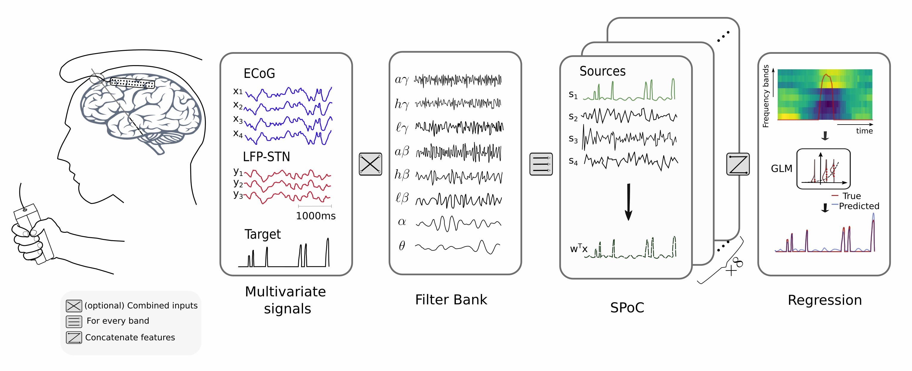

# Paper_SpatialPatternsMovementDecoding
<p align="center">

</p>
You will find here all the codes and instructions needed to reproduce the experiments performed in [Movement decoding using spatio-spectral features of cortical and subcortical local field potentials](https://www.sciencedirect.com/science/article/abs/pii/S0014488622002862), by Victoria Peterson, Timon Merk, Alan Bush, Vadim Nikulin, Andrea A. Kühn, Wolf-Julian Neumann and Mark Richardson.

### Installation guidelines
If you want to reproduce experiments and results made in this work, follow these steps:
1. Download and extract the zip or clone [Paper_SpatialPatternMovementDecoding](https://github.com/Brain-Modulation-Lab/Paper_SpatialPatternsMovementDecoding.git)
2. Go to the Paper_SpatialPatternMovementDecoding directory
3. Create conda environment
```
conda env create -f environment.yml
```
4. Activate conda environment
```
conda activate bml_spoc
```
5. Run the provided example
